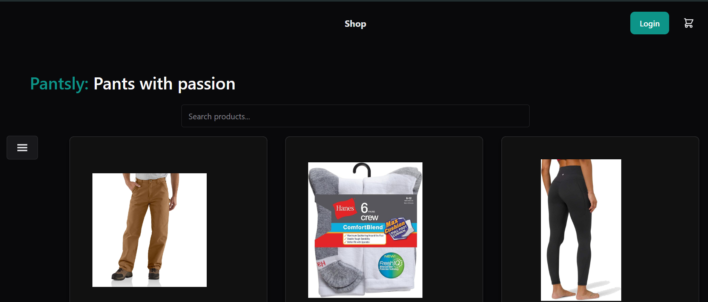
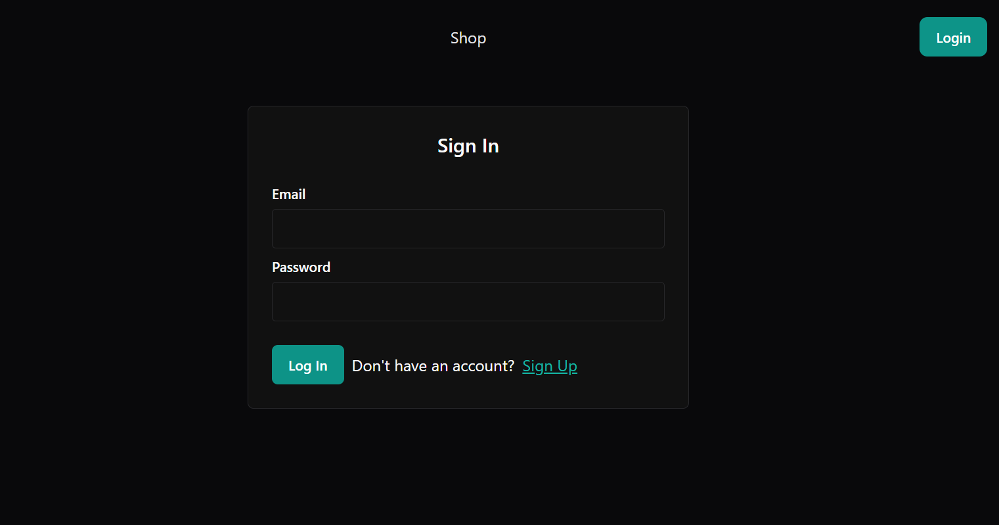
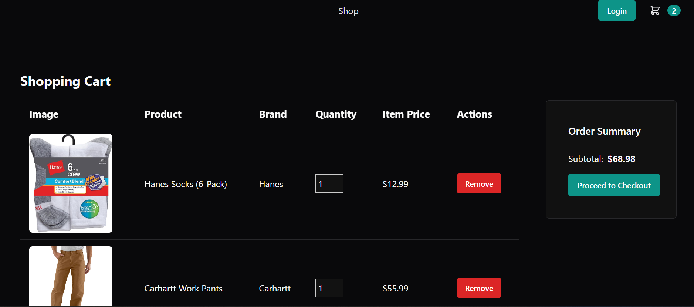
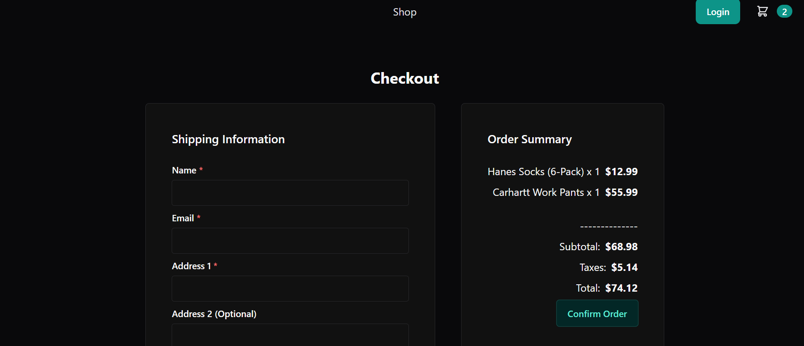
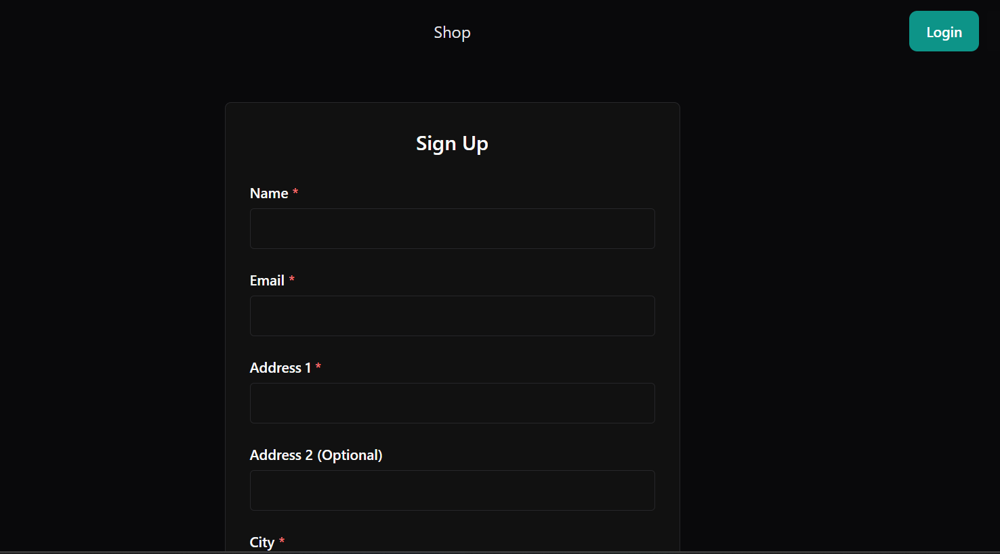

# Pantsly E-Commerce App

## Project Overview

Pantsly is a full-stack e-commerce application that allows users to browse and purchase products, create an account, log in, and view their order history. This platform includes authentication, product filtering and search capabilities, an admin panel for inventory management, and a secure checkout process.

### Screenshots

#### Home Page


#### Login Page


#### Shopping Cart


#### Checkout


#### Create User/Sign Up



## Features

### User Features:

- **User Authentication:** Sign up, log in, and manage user accounts.
- **Product Browsing:** View and filter products by brand, size, color, and price.
- **Search Functionality:** Search for products using keywords.
- **Shopping Cart:** Add and remove items before checkout.
- **Secure Checkout:** Complete purchases securely.
- **Order History:** View previous orders and order details.

### Admin Features:

- **Inventory Management:** Add, update, and delete products.
- **Order Management:** View and update order fulfillment statuses.
- **User Management:** Manage users and admin permissions.

## Technologies Used

### Frontend:

- React.js
- Vite.js
- Chakra UI
- React Context API for state management

### Backend:

- Node.js
- Express.js
- PostgreSQL (Database)
- Sequelize (ORM)
- JWT Authentication

### Other Dependencies:

- bcrypt (Password Hashing)
- dotenv (Environment Variables)
- JSON Web Token (Authentication)
- Nodemon (Development Server)

## Project Structure

```
Pantsly-Ecommerce-App/
│── client/              # Frontend React Application
│   │── src/             # Source directory for frontend
│       │── api/         # API calls and data fetching
│       │── assets/      # Images, icons, and other static files
│       │── components/  # Reusable UI components
│       │── context/     # React Context API for global state management
│       │── logic/       # Business logic functions
│       │── pages/       # Individual pages/views for the app
│       │── utils/       # Utility functions and helper files
│       │── App.jsx      # Main application component
│       │── main.jsx     # Entry point for React app
│
│── server/              # Backend Node.js & Express API
│   │── db/              # Database related files
│       │── schema.sql   # Database schema and setup script
│   │── src/             # Source directory for backend
│       ├── controllers/ # API Controllers for handling requests
│       ├── models/      # Database Models for Sequelize ORM
│       ├── routes/      # Express Routes for API endpoints
│       ├── seeds/       # Database Seeding Scripts
│       ├── config/      # Database Connection and configurations
│       │── server.js    # Main server entry file
│
│── .env                # Environment Variables configuration
│── package.json        # Project Metadata & Dependencies
│── package-lock.json   # Dependency lockfile
│── README.md           # Documentation
```

## Installation and Setup

### 1. Clone the repository:

```sh
git clone https://github.com/coder-guy-pete/pantsly
cd pantsly
```

### 2. Install dependencies:

```sh
npm install
```

### 3. Configure the environment:

Create a `.env` file in the root directory and add the following:

```sh
DB_NAME=pantsly_db
DB_USER=your_postgres_user
DB_PASSWORD=your_postgres_password
JWT_SECRET_KEY=your_secret_key
```

### 4. Seed the database:

```sh
npm run seed
```

### 5. Start the development server:

```sh
npm run start:dev
```

## API Endpoints

### User Routes

- `POST /auth/login` - Authenticate user and return JWT.
- `POST /users` - Register a new user.
- `GET /users/:id` - Get user details.

### Product Routes

- `GET /inventory/products` - Get all products.
- `GET /inventory/products/:id` - Get product by ID.
- `POST /inventory/products` - Add a new product (Admin).
- `PUT /inventory/products/:id` - Update product details (Admin).
- `DELETE /inventory/products/:id` - Delete product (Admin).

### Order Routes

- `GET /orders/:user_id` - Get user order history.
- `POST /orders` - Create a new order.

## Deployment & Repository

- **Live Demo**: [Pantsly on Render](https://pantsly.onrender.com)
- **Source Code**: [GitHub Repository](https://github.com/coder-guy-pete/pantsly)


## Contributors

- **Peter Hintze**
- **Jan Krajniak**
- **Corey Parsons**

## License

This project is licensed under the MIT License.
